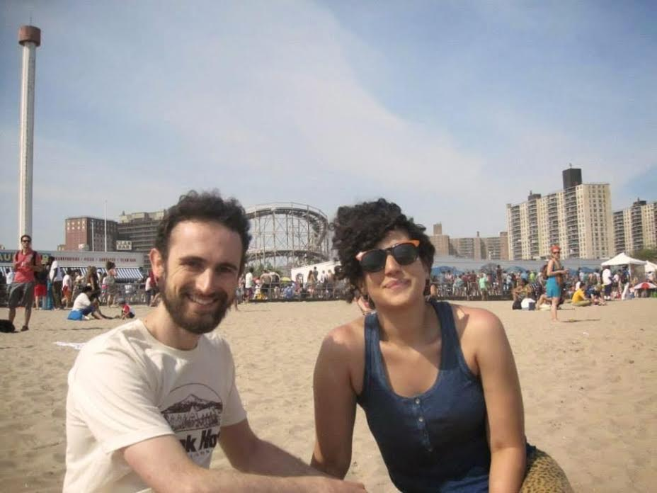
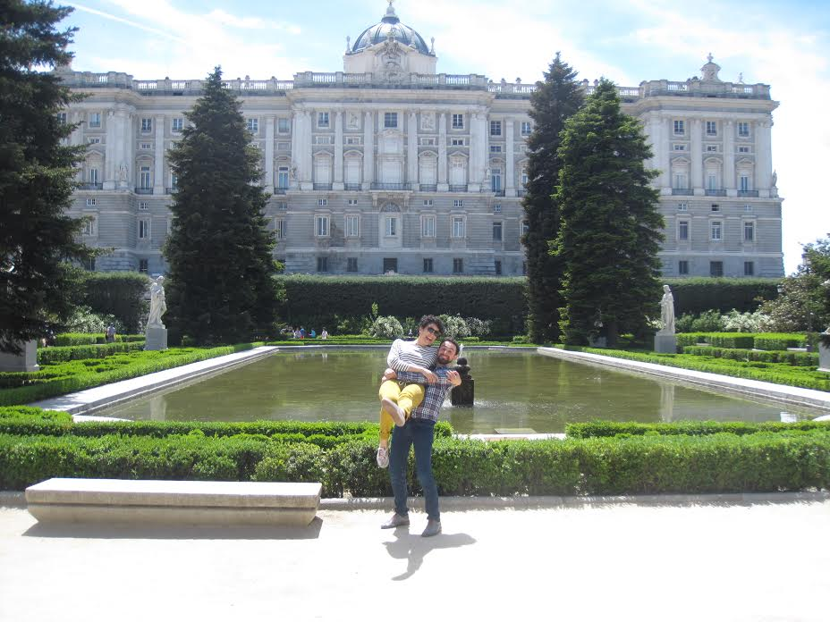
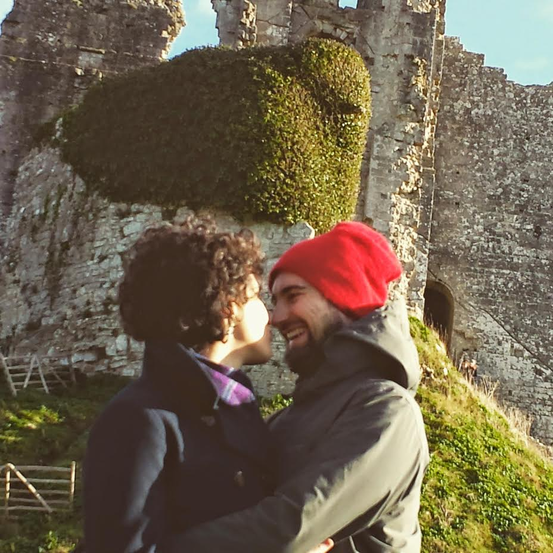
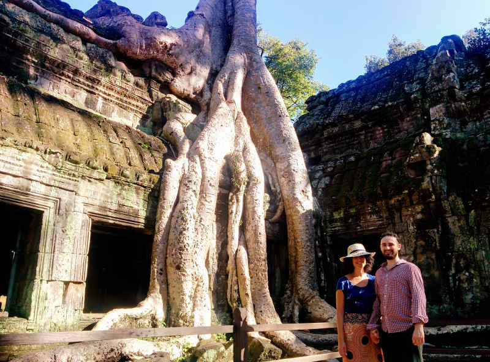
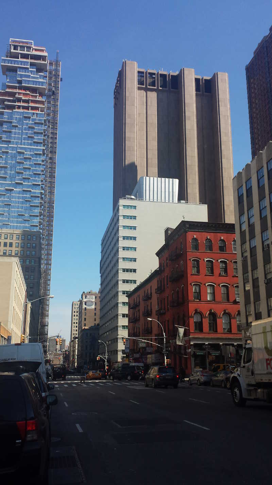

<h1 style="font-family: 'Alegreya SC'; text-align: center; font-size: 2em">Please Join Us Friday, March 4, 2016</h1>

# After meeting in New York...

# lots of video chats...

# traveling through places hot and cold...

# and three years together...

<h1 style="font-size: 5em; text-align: center; margin-top: 1.5em; ">We are eloping in Manhattan!</h1>

## Friday March 4

*We're sad that eloping means many of you can not make it, and we will hold a second reception in Europe later in the year*

**8:30 - 9** We will meet at the City Clerk's Office from 8.30am and will go inside at 9.
The courthouse allows up to 30 people to come in with us so, if you can't make, it's no problem we'll see you for the party.
If you can, RSVP to Gabriela so we know what to plan for :)

**9 - 10** There's no booking system because it’s first come first served, but we expect to be inside the City Clerk's Office for about an hour. 

**10 - 11** Assuming the weather is good, we will then walk down to City Hall Park and take more photos, potentially up to Brooklyn Bridge. If the weather is not good, we'll head straight to Lisa’s house.

**At 11** we'll walk back up to the Canal St subway station and take the yellow Q line towards Coney Island to a private residence.

**12 - 4** We'll be at the house until about 4 and, we know it’s a workday, so drop in if your schedule allows. 
This is a party! 

**8 onwards:** For all of our friends who can't make the day festivities, we’ll be at the Dream Downtown hotel bar for drinks.
We recommend the Ginger Lemonade (Puerto Rico + England!) 
Once again, feel free to drop by as time allows, we’d just love to see your face! 

## Saturday March 5

_Let us know if you'd like to join because we'll need to make reservations._

<!--
**10am** We'll meet for brunch at the [Indian Road Cafe](https://www.google.com/search?q=indian+road+cafe+new+york) which is direct on the express A train from 14th St.
Then we can wander back through the neighbourhood, with a [shorter](https://www.google.com/maps/dir/Indian+Road+Cafe,+600+West+218th+Street+%233,+New+York,+NY+10034/40.8655205,-73.9273104/@40.8668978,-73.9311594,4472m/data=!3m1!1e3!4m14!4m13!1m10!1m1!1s0x89c2f3f220881473:0x7c692add633abbf!2m2!1d-73.9184218!2d40.8728287!3m4!1m2!1d-73.9265525!2d40.8766861!3s0x89c2f3e5403ecb85:0xfa1a0818fd1c839f!1m0!3e2) or [longer](https://www.google.com/maps/dir/Indian+Road+Cafe,+600+West+218th+Street+%233,+New+York,+NY+10034/40.8473472,-73.9397325/@40.858761,-73.9382429,4809m/data=!3m1!1e3!4m24!4m23!1m20!1m1!1s0x89c2f3f220881473:0x7c692add633abbf!2m2!1d-73.9184218!2d40.8728287!3m4!1m2!1d-73.9265525!2d40.8766861!3s0x89c2f3e5403ecb85:0xfa1a0818fd1c839f!3m4!1m2!1d-73.9321573!2d40.8656528!3s0x89c2f4009747eb95:0x11835d93079ad4eb!3m4!1m2!1d-73.9380351!2d40.85469!3s0x89c2f6a708339fc1:0xffb40c5311b84cd1!1m0!3e2) path depending on the day. 
-->

In the afternoon we'll go see the [MoMA PS1](https://www.google.com/search?q=moma+ps1+nyc) and do dinner somewhere fun, like the [Court Square Diner](https://www.google.com/maps/place/Court+Square+Diner/@40.7471865,-73.9492755,16.9z) nearby, or [Sylvia's](https://www.google.com/maps/place/Sylvia's+Restaurant/@40.8089715,-73.9515077,16.51z/) in Harlem (the fried chicken is serious), or [Siggy's](https://www.google.com/maps/place/Siggy's+Good+Food/@40.7230103,-73.9921601,17z/) in Soho, or [Mercato](https://www.google.com/maps/place/Mercato,+352+W+39th+St,+New+York,+NY+10018/@40.7565069,-73.9923564,16z/) in Midtown. 
Maybe later go see a movie, like [Race](https://www.google.com/search?q=race+movie), or, [The Mermaid](https://www.google.com/search?q=mermaid+movie).

### Directions

For directions to Lisa's house, email us before or call us on the day.

* City Clerk's Office: 141 Worth Street, Manhattan ([google map](https://www.google.com/maps/place/141+Worth+St,+New+York,+NY+10013/))

Take the A train to Chambers St, exit the train and walk back towards where the train came from, exit through the turnstiles and turn left. 
Go straight as you come up to the street and you'll see a new, very tall, apartment building being constructed straight ahead. 
After a few blocks turn right on Worth Street and follow it a few blocks.

* City Hall Park: Just south of the Clerk's Office ([google map](https://www.google.com/maps/place/City+Hall+Park/@40.7131601,-74.0063889,15z/))
* Dream Downtown Hotel: 355 W 16th St, Manhattan ([google map](https://www.google.com/maps/place/Dream+Downtown/@40.742257,-74.0033957,15z/))

To get the Dream Downtown Hotel, go to 14th St subway station on the blue ACE line (A is best, as it runs express) or grey L line. 
Get off the train, take the stairs up to the station concourse and walk north (away from the grey L line) to the north end, and turn left after the turnstiles.
Then take the stairs to the street on the right, and take the left fork on the stairs. 
Go straight as you come up to the street and at the end of the block the hotel is on your right. 

### Dress Code

Courthouse Chic, or, ask Gabriela. 
Not Dave.

### Photography

We have a professional photographer until 10:30. 
After that, we're relying on you all to share your reception photos with us :) 

### Social Media

\#daveandgabriela (You have to, right?)

* <i class="fa fa-twitter-square">Twitter</i> [#daveandgabriela](https://twitter.com/search?f=tweets&q=%23daveandgabriela&src=typd)
* <i class="fa fa-instagram">Instagram</i> [#daveandgabriela](https://www.instagram.com/explore/tags/daveandgabriela)
* <i class="fa fa-facebook-square">Facebook</i> [#daveandgabriela](https://www.facebook.com/search/top/?q=%23daveandgabriela)
* <i class="fa fa-dropbox">Dropbox</i> <dave@lab6.com>
* <i class="fa fa-google">Google Photos</i> [Google Photos](https://goo.gl/photos/nyCcJaHQS6GMRa47A)

### Contacts

* <i class="fa fa-phone-square">Telephone</i> [+1-415-343-5226](tel:+1-415-343-5226)
* <i class="fa fa-envelope">Email</i> <daveandgabriela@daveandgabriela.com> goes to us both
* <i class="fa fa-google-plus">Google Plus</i> [+DaveCrossland](https://plus.google.com/+DaveCrossland/about)
* <i class="fa fa-twitter-square">Twitter</i> [@davelab6](https://twitter.com/davelab6)
* <i class="fa fa-instagram">Instagram</i> [@davelab6](https://instagram.com/davelab6) [@he_aqui_gaby](https://instagram.com/he_aqui_gaby)
* <i class="fa fa-facebook-square">Facebook</i> [facebook.com/davelab6](https://facebook.com/davelab6)

### P.S. Gifts

We don't really need more things. 
There are some kinds of kitchen items that would be lovely, though not necessary at all. 
They can be [found on Amazon](https://www.amazon.com/registry/wedding/353LWQHVKE8V3).
